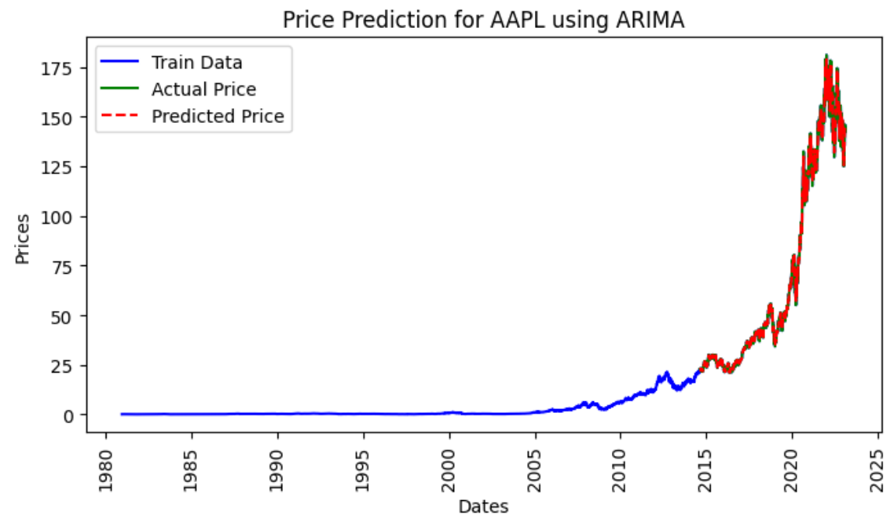
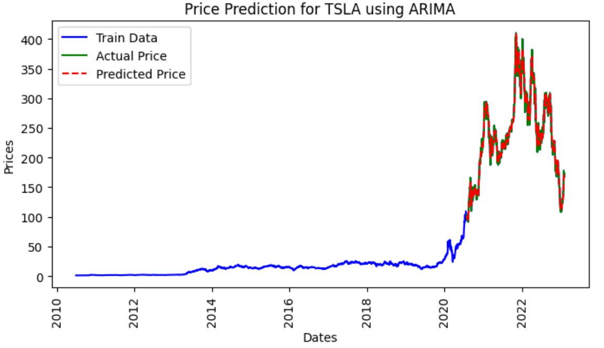
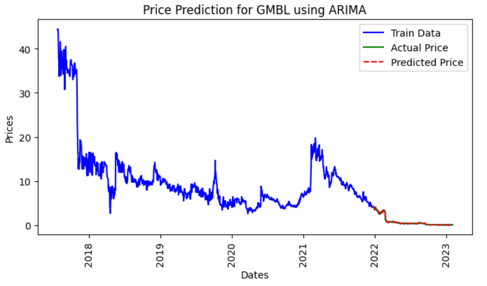
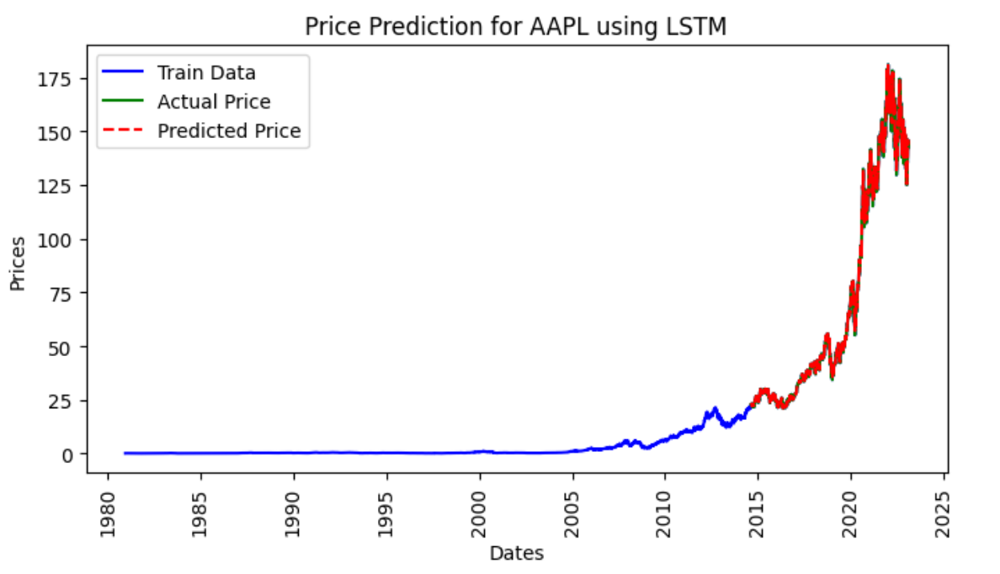
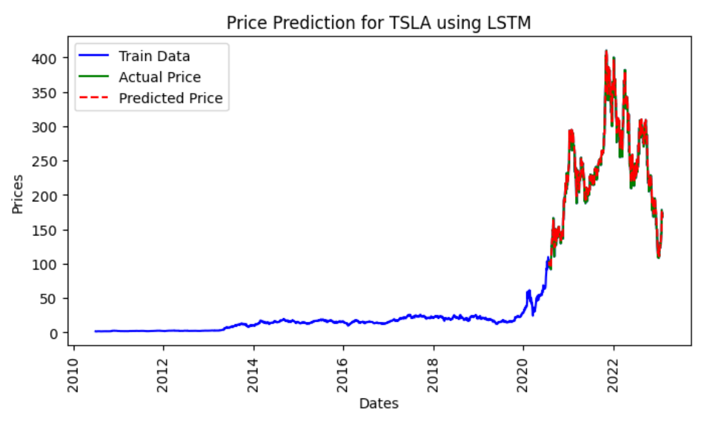
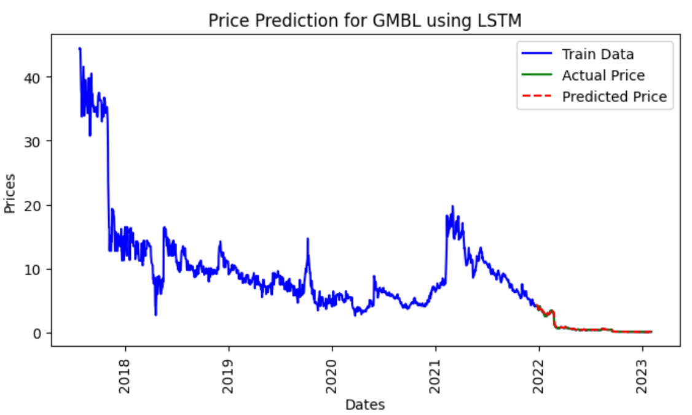

# Stock Market Analysis and Prediction

This project focuses on the analysis and prediction of stock market data using various machine learning and time series models, including ARIMA, LSTM, and XGBoost. The goal is to preprocess historical stock data, perform exploratory data analysis (EDA), and then use different models to forecast future stock prices.

## Project Structure

The project is organized into several key modules and notebooks:

- **Main Script (`main.py`)**: This serves as the entry point for running the pipeline. It handles dataset loading, preprocessing, and model execution based on user input.
  
- **Jupyter Notebooks**:
  - **Exploratory Data Analysis**: Contains visualizations and statistical analyses to explore trends, seasonality, and patterns in the stock market data.
  - **Model Testing and Results**: Evaluates the performance of various models, including neural networks (LSTM), time series models (ARIMA), and ensemble methods (XGBoost).

- **`mlts/` Directory**: 
  - **`analysis/`**: Contains notebooks for EDA and model testing.
  - **`config/`**: Configuration files for the project.
  - **`factory/`**: Factories for dataset handling, model creation, and data preprocessing.
  - **`models/`**: Implementations of different models, including ARIMA, LSTM, and XGBoost.
  - **`preprocessor/`**: Custom preprocessing modules for stock data.
  - **`static/`**: Contains datasets, both original and preprocessed, for stocks like AAPL, TSLA, and GMBL.
  - **`utils/`**: Utility scripts for data handling and saving models.

## Key Features

1. **Data Preprocessing**: The project uses a custom stock data preprocessor to clean and prepare data for modeling.
2. **Exploratory Data Analysis**: In-depth analysis and visualizations to identify market trends and seasonality.
3. **Modeling**: Implementation of various forecasting models:
   - **ARIMA**: A classical time series model for forecasting.
   - **LSTM**: A deep learning model for capturing long-term dependencies in sequential data.
   - **XGBoost**: An ensemble method that is highly effective for time series prediction.
4. **Model Evaluation**: The models are evaluated on key metrics like Mean Squared Error (MSE) and Mean Absolute Error (MAE) to assess their performance.

## Setup and Installation

To run this project, you will need to install the required dependencies listed in the `requirements.txt` file:

```bash
pip install -r requirements.txt
```

## Running the Project

To run the analysis pipeline, use the `main.py` script. You can specify the model and dataset to use through command-line arguments:

```bash
python main.py --model lstm --dataset aapl
```

This command will run the LSTM model on the AAPL stock data. The available models are `lstm`, `arima`, and `xgb`, and the available datasets are `aapl`, `tsla`, and `gmbl`.

## Results

After training and testing various models on stock market data, the following results were obtained:

### 1. **ARIMA Model**
   - **Stock**: [AAPL, TSLA, GMBL]
   - **Evaluation Metrics**:
     - **Root Mean Squared Error (RMSE)**: [1.259,7.188,0.098]
     - **Mean Absolute Error (MAE)**: [0.743,5.313,0/038]
   - **Visualization**: Below is the comparison between the actual stock prices and the ARIMA model's predicted prices.

 <p align="center">
     
     
     
   </p>
   
### 2. **LSTM Model**
   - **Stock**: [AAPL, TSLA, GMBL]
   - **Evaluation Metrics**:
     - **Root Mean Squared Error (RMSE)**: [0.881,5.047,0.096]
     - **Mean Absolute Error (MAE)**: [0.378,2.844,0.028]
   - **Visualization**: Below is the comparison between the actual stock prices and the LSTM model's predicted prices.

 <p align="center">
     
     
     
   </p>

### 3. **XGBoost Model**
   - **Stock**: [AAPL, TSLA, GMBL]
   - **Evaluation Metrics**:
     - **Root Mean Squared Error (RMSE)**: [0.010,0.102,0.003]
     - **Mean Absolute Error (MAE)**: [0.023,0.016,0.001]
   - **Visualization**: Below is the comparison between the actual stock prices and the XGBoost model's predicted prices.

  <p align="center">
     
     
     
   </p>

### Conclusion
Among the models tested, **XGBoost** performed best, delivering the most accurate predictions with the lowest error rates across all stock datasets. **LSTM** also performed well, particularly with complex stock price patterns, while **ARIMA** was effective for simpler time series but struggled with more volatile stocks like TSLA. Overall, XGBoost is recommended for stock price prediction in this analysis.
